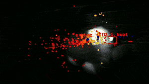
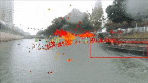

#  
<h4>USV-Based 4D Radar-Camera Tracking Dataset for Autonomous Driving in Inland Waterways</h4>

 

* Website: [https://usvtrack.github.io](https://usvtrack.github.io)

## Overview
- [Changelog](#changelog)
- [Dataset](#dataset)
- [Devkit](#devkit)
- [Acknowledgement](#acknowledgement)
- [Citation](#citation)

## Changelog
- :star2: June 16, 2025: USVTrack dataset is accepted by IROS ([arXiv](https://arxiv.org/abs/2506.18737))
- March 6, 2025: USVTrack dataset is released at [Baidu Netdisk](https://pan.baidu.com/s/1N7EGmTuWsnT_INLN9VoE1w?pwd=data), [Google Drive 1](https://drive.google.com/drive/folders/1KJ92O-SQ0Mow1SNqA3N1_zQYYA3zlOUK?usp=sharing), [Google Drive 2](https://drive.google.com/drive/folders/1XnvjnlZcvGqdRTeK9WZkrCh-rwwAK_Ql?usp=sharing)

## Dataset
### Introduction

 

* USVTrack, the first **USV-based 4D radar-camera tracking dataset** in inland waterways, which offers data from multiple sensors, including a 4D radar, monocular camera, GPS, and IMU.
* USVTrack contains a rich diversity of data samples, including **various waterways** (wide and narrow rivers, lakes, canals, moats and docks), diverse **time conditions** (daytime, nightfall, night), **weather conditions** (sunny, overcast, rainy, snowy), and **lighting conditions** (normal, dim, strong).
* We provide **2D bounding box** with **track ID** annotations. We also offer a **toolkit** to help researchers in processing, analyzing and training on our dataset.
* We build corresponding benchmarks and evaluate popular algorithms for object detection and object tracking tasks.

    
    
    


### USV Setup
 


### Dataset Structure

```
USVTrack (root)
  - images # RGB images
    - train
      - folder
        - 000001.jpg
        - 000002.jpg
        - xxx
    - test
      - folder
        - 000001.jpg
        - 000002.jpg
        - xxx
  - radar # radar files
    - folder
      - 000001.csv

  - YOLO # YOLO format for vision detection
    - images # put all images here
    - labels # all labels for detection
    - class.txt
    - train.txt
    - test.txt

```

### Labels
| Code | Label      | Note                                               |
|------|------------|----------------------------------------------------|
| -1   | no-object  | No object. Only for radar point clouds             |
| 1    | ship       |                                                    |
| 2    | boat       |                                                    |
| 3    | vessel     |                                                    |

### Radar Format
Radar point clouds are stored in csv files.


Each csv file contains a set of points in a specific timestamp:
| Column        | Description                                                     |
|---------------|-----------------------------------------------------------------|
| timestamp     | timestamp of the point                                          |
| range         | radial distance to the detection (in m)                         |
| doppler       | radial velocity measured for this point (in m/s)                |
| azimuth       | azimuth angle to the detection (in degree)                      |
| elevation     | elevation angle to the detection (in degree)                    |
| power         | reflected power value of the detection (in dB)                  |
| x             | x value in the XYZ coordinates                                  |
| y             | y value in the XYZ coordinates                                  |
| z             | z value in the XYZ coordinates                                  |
| comp_height   | absolute height of the point (in m)                             |
| comp_velocity | absolute velocity of the point (in m/s)                         |
| u             | x-axis on the image plane                                       |
| v             | y-axis on the image plane                                       |
| label         | semantic class id of the object （Refer to [Labels](#labels)）   |

### GPS Format

| Column                  | Description                            |
|-------------------------|----------------------------------------|
| timestamp               | current timestamp                      |
| latitude                | latitude                               |
| longitude               | longitude                              |
| number_of_satellites    | number of satellites                   |
| altitude                | altitude                               |
| true_north_heading      | true north heading to the earth        |
| magnetic_north_heading  | magnetic north heading to the earth    |
| ground_speed_kn         | speed (in kn)                          |
| ground_speed_kph        | speed (in km/h)                        |

### IMU Format

| Column                | Description                            |
|-----------------------|----------------------------------------|
| timestamp             | current timestamp                      |
| pitch                 | pitch (x-axis, right)                  |
| roll                  | roll (y-axis, front)                   |
| yaw                   | yaw (z-axis, top)                      |
| angular_velocity_x    | angular velocity in x-axis             |
| angular_velocity_y    | angular velocity in y-axis             |
| angular_velocity_z    | angular velocity in z-axis             |
| linear_velocity_x     | linear velocity in x-axis              |
| linear_velocity_y     | linear velocity in y-axis              |
| linear_velocity_z     | linear velocity in z-axis              |
| magnetic_field_x      | magnetic field strength in x-axis      |
| magnetic_field_y      | magnetic field strength in y-axis      |
| magnetic_field_z      | magnetic field strength in z-axis      |


## Acknowledgement
* We referred to the [nuScenes](https://github.com/nutonomy/nuscenes-devkit), [RadarScenes](https://github.com/oleschum/radar_scenes) and [View of Delft](https://github.com/tudelft-iv/view-of-delft-dataset) datasets, and are grateful to their websites and github repositories.

## Citation

The USVTrack data is published under CC BY-NC-SA 4.0 license, which means that anyone can use this dataset for non-commercial research purposes.

Please use the following citation when referencing
```
@INPROCEEDINGS{yao2025usvtrack,
      title={USVTrack: USV-Based 4D Radar-Camera Tracking Dataset for Autonomous Driving in Inland Waterways},
      booktitle={2025 IEEE/RSJ International Conference on Intelligent Robots and Systems (IROS)}, 
      author={Shanliang Yao and Runwei Guan and Yi Ni and Sen Xu and Yong Yue and Xiaohui Zhu and Ryan Wen Liu},
      year={2025}
}
```
